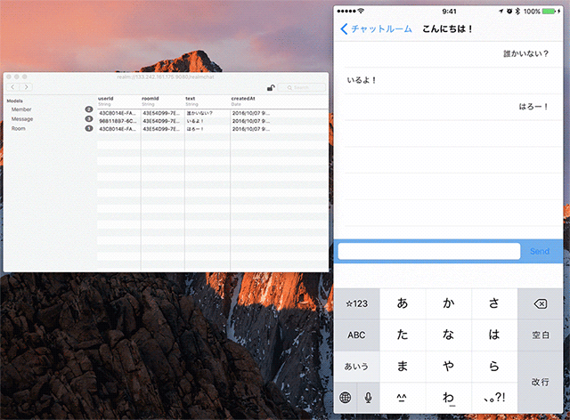

# RealmChat sample

Sample of iOS chat application with Realm and Realm Object Server.



## Usage

### Carthage

Run `carthage update --platform iOS` with your terminal.

### Realm Object Server setting

Modify **RealmChat/Supports/RealmConstants.swift**

```swift
enum RealmConstants {
    private static let host: String = "127.0.0.1" //YOUR Realm Object Server host name here
    private static let databaseName: String = "realmchat" //database name
    private static let port: Int = 9080 //Realm Object Server Port here
    static let authURL: URL = URL(string: "http://\(host):\(port)")!
    static let realmURL: URL = URL(string: "realm://\(host):\(port)/\(databaseName)")!
    static let adminToken: String = "YOUR ADMIN TOKEN HERE" //admin token here ex: /etc/realm/admin_token.base64
    static let identity: String = "USER IDENTITY HERE" // RLMSyncUser.identity

    static func setDefaultUser(user: RLMSyncUser) {
        let configuration: Realm.Configuration = Realm.Configuration(syncConfiguration: (user, realmURL))
        Realm.Configuration.defaultConfiguration = configuration
    }
}
```
